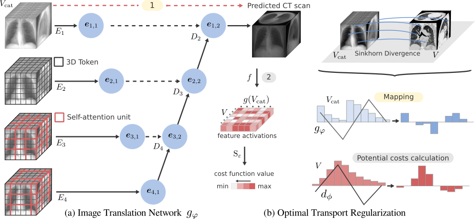

This is the official code for the CVPRW-DCA in MI 2024 paper "Repeat and Concatenate: 2D to 3D Image Translation with 3D to 3D Generative Modeling"



## Usage
```
python ot_train_3d.py --config/experiments/2v.yaml --cuda
```
```
python eval_metrics.py --configs/experiments/CONFIG.yaml --cuda --model_path /path/to/model.pth
```

## BibTeX

```
@inproceedings{coronafigueroaa24repeat,
 author={Corona-Figueroa, Abril and Shum, Hubert P. H. and Willcocks, Chris G.},
 booktitle={Proceedings of the 2024 IEEE/CVF Conference on Computer Vision and Pattern Recognition Workshops (CVPRW)},
 series={CVPRW '24},
 title={Repeat and Concatenate: 2D to 3D Image Translation with 3D to 3D Generative Modeling},
 year={2024},
 publisher={IEEE/CVF},
 location={Seattle, USA},
}
```
